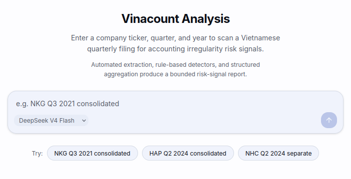

# Vinacount

Vinacount is a Controlled Accounting Agent for Vietnamese quarterly financial
reports. It accepts a filing intent (company, quarter, year, report basis),
confirms source filings, builds structured evidence, runs deterministic
accounting checks and detector verification, and renders a conservative
risk-signal report with page-linked evidence navigation.



## Quick Start

### Backend

```bash
python3 -m venv .venv
source .venv/bin/activate
pip install -e .
pip install -r requirements-runtime.txt
```

Start the backend (deterministic demo, no API keys needed):

```bash
PYTHONPATH=src \
uvicorn vinacount.runtime_api:create_public_demo_runtime_app \
  --factory --host 127.0.0.1 --port 8024
```

### Frontend

```bash
cd frontend
npm ci
NEXT_PUBLIC_RUNTIME_API_URL=http://127.0.0.1:8024 \
npm run dev -- --hostname 127.0.0.1 --port 3024
```

Open http://127.0.0.1:3024.

### Smoke Tests

```bash
PYTHONPATH=src:. pytest tests/public_smoke
```

## Try Examples

- `NKG Q3 2021 consolidated`
- `HAP Q2 2024 consolidated`
- `NHC Q2 2024 separate`

## Demo Modes

The repository supports four runtime modes. The deterministic demo above works
out of the box. The other modes require local artifact files — download them
from the [external artifact manifest](SUBMISSION_ARTIFACT_MANIFEST.md).

### 1. Sealed Demo Replay

Best presentation fallback. Try buttons load completed locked runs. No new run
creation, no Nanonets, no DeepSeek, no detector calls.

Backend:

```bash
PYTHONPATH=src \
VINACOUNT_RUNTIME_RUN_REGISTRY_DB_PATH=artifacts/runtime_thesis_qaqc_metrics_pack/runtime_run_registry.sqlite3 \
./.venv/bin/uvicorn vinacount.runtime_api:create_runtime_app --factory --host 127.0.0.1 --port 8024
```

Frontend:

```bash
cd frontend
NEXT_PUBLIC_RUNTIME_API_URL=http://127.0.0.1:8024 \
NEXT_PUBLIC_TRY_EXAMPLE_MODE=sealed_replay \
npx next dev --webpack --hostname 127.0.0.1 --port 3024
```

Direct run URL:

```
http://127.0.0.1:3024/?run=run_qaqc_nkg_2021_q3_consolidated_report_memory_reuse
```

### 2. Cached-First Live Confirmation

Best "live-feeling but safe" demo. Try buttons create fresh runs and show live
Source Confirmation, then reuse locked cached artifacts. No Nanonets, no
DeepSeek report synthesis, no vLLM detector call after confirmation.

Backend:

```bash
PYTHONPATH=src \
VINACOUNT_RUNTIME_PRESENTATION_MODE=cached_first_live_confirmation \
./.venv/bin/uvicorn vinacount.runtime_api:create_runtime_app --factory --host 127.0.0.1 --port 8024
```

Frontend:

```bash
cd frontend
NEXT_PUBLIC_RUNTIME_API_URL=http://127.0.0.1:8024 \
NEXT_PUBLIC_TRY_EXAMPLE_MODE=cached_first_live_confirmation \
npx next dev --webpack --hostname 127.0.0.1 --port 3024
```

### 3. Normal Live Runtime

Real runtime path. Source discovery, cache lookup, extraction if needed,
detector mode from env, report synthesis from env. Calls providers depending on
cache state and config.

Backend (model synthesis + self-hosted detector):

```bash
PYTHONPATH=src \
VINACOUNT_RUNTIME_DETECTOR_MODE=sft_vllm \
VINACOUNT_REPORT_GENERATION_MODE=model_synthesis \
./.venv/bin/uvicorn vinacount.runtime_api:create_runtime_app --factory --host 127.0.0.1 --port 8024
```

Frontend:

```bash
cd frontend
NEXT_PUBLIC_RUNTIME_API_URL=http://127.0.0.1:8024 \
NEXT_PUBLIC_TRY_EXAMPLE_MODE=live_draft \
npx next dev --webpack --hostname 127.0.0.1 --port 3024
```

`live_draft` means Try buttons fill a filing-intent draft first; typed custom
prompts also use this live path.

### 4. Locked NKG Fixture Path

Old opt-in screenshot/test fixture path for one NKG scenario.

Backend:

```bash
PYTHONPATH=src \
VINACOUNT_RUNTIME_THESIS_DEMO_SCENARIO=nkg_2021_q3_consolidated \
VINACOUNT_RUNTIME_REAL_CACHE_MODE=locked_cached_report_memory \
./.venv/bin/uvicorn vinacount.runtime_api:create_runtime_app --factory --host 127.0.0.1 --port 8024
```

Frontend:

```bash
cd frontend
NEXT_PUBLIC_RUNTIME_API_URL=http://127.0.0.1:8024 \
NEXT_PUBLIC_TRY_EXAMPLE_MODE=live_draft \
npx next dev --webpack --hostname 127.0.0.1 --port 3024
```

## Self-Hosted Detector (vLLM)

Normal Live Runtime with `sft_vllm` detector mode requires a local vLLM server
hosting the Qwen3.5-4B LoRA detector adapter. You need a GPU with at least
24 GB VRAM.

Download the LoRA adapter from the external artifact manifest (folder 03), then
serve it with vLLM:

```bash
CUDA_VISIBLE_DEVICES=0 vllm serve unsloth/Qwen3.5-4B \
  --host 127.0.0.1 --port 8000 \
  --dtype bfloat16 \
  --max-model-len 8192 \
  --gpu-memory-utilization 0.85 \
  --max-num-seqs 1 \
  --enable-lora \
  --max-lora-rank 16 \
  --lora-modules '{"name":"vinacount-qwen-lora-detector-v1","path":"./adapter","base_model_name":"unsloth/Qwen3.5-4B"}'
```

The runtime expects the vLLM endpoint at `http://127.0.0.1:8000/v1` by default.

## Environment Variables

For live model-backed runs, provide your own API keys:

```bash
export DEEPSEEK_API_KEY="<your-deepseek-api-key>"
export NANONETS_API_KEY="<your-nanonets-api-key>"
```

## Research Tools

The `research/` directory contains the synthetic data generation pipeline,
detector training, and evaluation code. See
[research/README.md](research/README.md) for details.

## External Artifacts

Large artifacts (datasets, detector adapter, source PDFs, OCR caches,
screenshots) are hosted on Google Drive. See
[SUBMISSION_ARTIFACT_MANIFEST.md](SUBMISSION_ARTIFACT_MANIFEST.md) for the
full list with checksums.

## License

This repository is part of a graduation thesis project.
